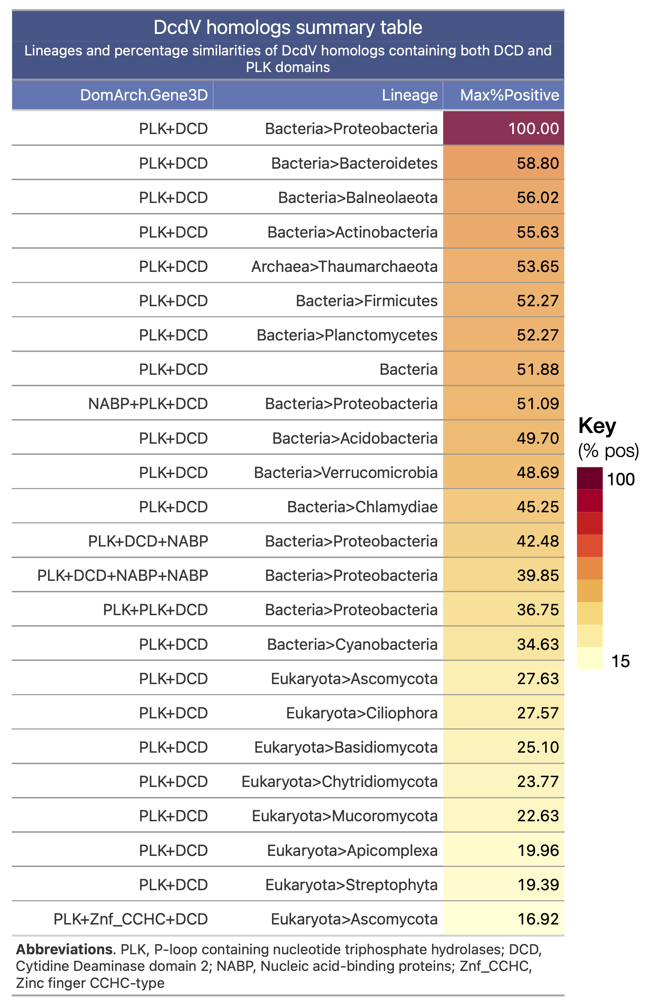

class: center, top
background-image: url(https://upload.wikimedia.org/wikipedia/commons/b/be/Sharingan_triple.svg)

```{r setup, include=FALSE}
options(htmltools.dir.version = FALSE)
```

# Slides made with `xaringan`

---
class: inverse, center, middle

# Overview

---
class: center, top
# GT
```{r gt1, echo=FALSE, fig.cap="", out.width = '70%'}
knitr::include_graphics("https://gt.rstudio.com/reference/figures/gt_parts_of_a_table.svg")
```

---
class: center, top
# knitr
```{r knitr, echo=FALSE, fig.cap="", out.height = '70%'}
knitr::include_graphics("https://db.yihui.org/imgur/yYw46aF.jpg")
```

---
class: center, top
# rmarkdown
```{r rmarkdown, echo=FALSE, fig.cap="", out.height = '70%'}
knitr::include_graphics("https://i2.wp.com/jessecambon.github.io/images/hex-rmarkdown.png?w=200&ssl=1")
```

---
class: center, top
# DT & datatables
```{r datatable, echo=FALSE, fig.cap="", out.width = '50%'}
knitr::include_graphics("https://shiny.rstudio.com/images/datatable.png")
```
---
class: center, top
# Explore later: flextable

```{r flextable, echo=FALSE, fig.cap="", out.width = '70%'}
knitr::include_graphics("https://ardata-fr.github.io/flextable-book/assets/img/flextable_functions.svg")
```
---
class: inverse, middle, center
# Let's create a few cool tables!

---
# Tables w/ `knitr`

If you want to generate a table, make sure it is in the HTML format (instead of Markdown or other formats), e.g.,

```{r}
knitr::kable(head(iris), format = 'html')
```

---
# Tables w/ `rmarkdown`

```{r eval=require('rmarkdown'), tidy=FALSE, out.height='70%'}
paged_table(iris)
```

---
# Tables w/ `kableExtra`
```{r kableExtra, eval=require('kableExtra'), tidy=FALSE, out.height='70%'}
iris %>% head %>%
	kable(caption = "Table 1. Annotate with kableExtra") %>%
	kable_styling(c("striped", "hover", "condensed"), full_width = F,
								position = "left") %>%
	add_header_above(c("categorical"=1, "numerical" = 4)) %>%
	column_spec(1, bold = T) %>%
	row_spec(0, italic = T)
```

---
# Tables w/ `gt`

```{r gt, echo=FALSE, fig.cap="", fig.align = 'center', out.height='25%'}

```

---
# DT and datatable
```{r DT, eval=require('DT'), tidy=FALSE, out.height='70%'}
iris %>% head() %>% 
	datatable(fillContainer=FALSE,
						options=list(pageLength=8))
```

---
class: center, middle

## [Tables with `knitr`, `rmarkdown`, `DT`](tables_dt.html)
<br>
## [Tables with `GT`](tables_gt.html)


---
# References
- knitr: https://yihui.org/knitr/
- kableExtra: https://haozhu233.github.io/kableExtra/
- rmarkdown: https://rmarkdown.rstudio.com/
- DT: https://rstudio.github.io/DT/
- GT: https://gt.rstudio.com/index.html (cites other useful packages too)
- Also checkout flextable: https://davidgohel.github.io/flextable/

---
class: center, middle, inverse

# Thanks!
<br> <br>
#### How to reach me?

### Email: [janani@msu.edu](mailto:janani@msu.edu)
### Webpage: [jravilab.github.io](https://jravilab.github.io)
### Twitter: [@janani137](https://twitter.com/janani137)

<br>
<br>
Slides created via the R package [**xaringan**](https://github.com/yihui/xaringan).
