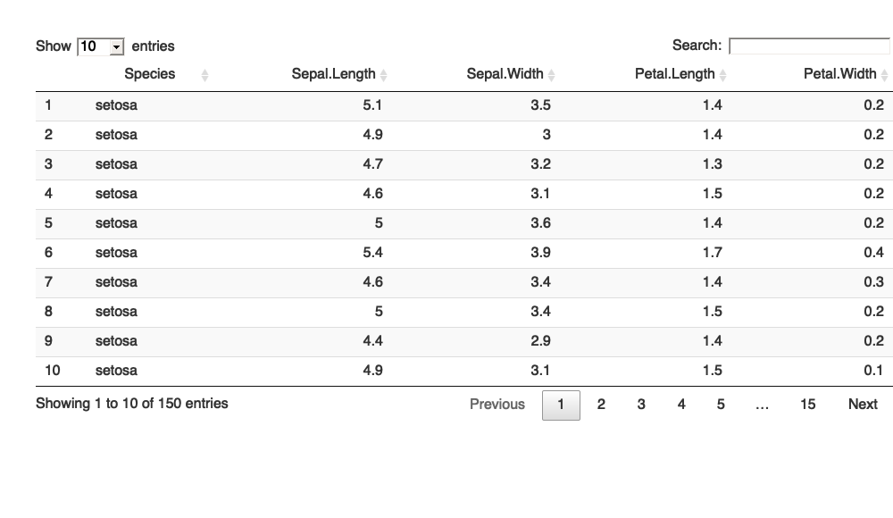
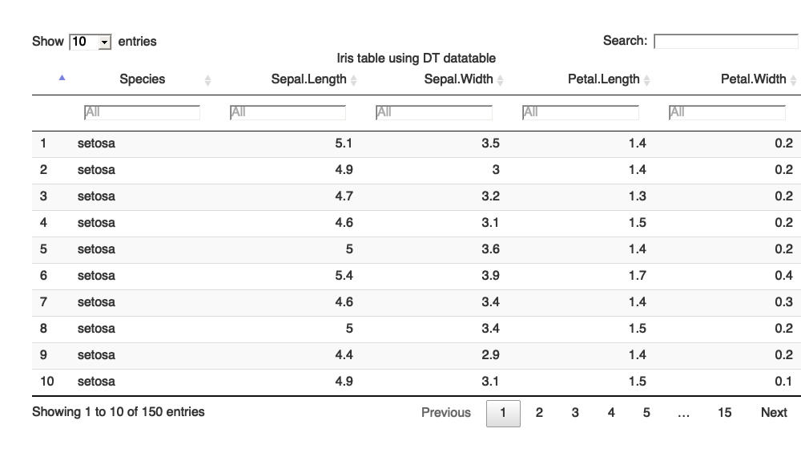

Interactive Tables
================
Janani Ravi
May 09, 2021

``` r
library(tidyverse)
```

    ## ── Attaching packages ─────────────────────────────────────── tidyverse 1.3.1 ──

    ## ✓ ggplot2 3.3.3     ✓ purrr   0.3.4
    ## ✓ tibble  3.1.0     ✓ dplyr   1.0.5
    ## ✓ tidyr   1.1.3     ✓ stringr 1.4.0
    ## ✓ readr   1.4.0     ✓ forcats 0.5.1

    ## ── Conflicts ────────────────────────────────────────── tidyverse_conflicts() ──
    ## x dplyr::filter() masks stats::filter()
    ## x dplyr::lag()    masks stats::lag()

``` r
glimpse(iris)
```

    ## Rows: 150
    ## Columns: 5
    ## $ Sepal.Length <dbl> 5.1, 4.9, 4.7, 4.6, 5.0, 5.4, 4.6, 5.0, 4.4, 4.9, 5.4, 4.…
    ## $ Sepal.Width  <dbl> 3.5, 3.0, 3.2, 3.1, 3.6, 3.9, 3.4, 3.4, 2.9, 3.1, 3.7, 3.…
    ## $ Petal.Length <dbl> 1.4, 1.4, 1.3, 1.5, 1.4, 1.7, 1.4, 1.5, 1.4, 1.5, 1.5, 1.…
    ## $ Petal.Width  <dbl> 0.2, 0.2, 0.2, 0.2, 0.2, 0.4, 0.3, 0.2, 0.2, 0.1, 0.2, 0.…
    ## $ Species      <fct> setosa, setosa, setosa, setosa, setosa, setosa, setosa, s…

``` r
iris <- iris[,c(5,1:4)]
glimpse(iris)
```

    ## Rows: 150
    ## Columns: 5
    ## $ Species      <fct> setosa, setosa, setosa, setosa, setosa, setosa, setosa, s…
    ## $ Sepal.Length <dbl> 5.1, 4.9, 4.7, 4.6, 5.0, 5.4, 4.6, 5.0, 4.4, 4.9, 5.4, 4.…
    ## $ Sepal.Width  <dbl> 3.5, 3.0, 3.2, 3.1, 3.6, 3.9, 3.4, 3.4, 2.9, 3.1, 3.7, 3.…
    ## $ Petal.Length <dbl> 1.4, 1.4, 1.3, 1.5, 1.4, 1.7, 1.4, 1.5, 1.4, 1.5, 1.5, 1.…
    ## $ Petal.Width  <dbl> 0.2, 0.2, 0.2, 0.2, 0.2, 0.4, 0.3, 0.2, 0.2, 0.1, 0.2, 0.…

``` r
## Simple interactive datatable
iris %>%
    DT::datatable()
```

<!-- -->

``` r
## Using kable
library(knitr)
iris %>%
    kable()
```

| Species    | Sepal.Length | Sepal.Width | Petal.Length | Petal.Width |
|:-----------|-------------:|------------:|-------------:|------------:|
| setosa     |          5.1 |         3.5 |          1.4 |         0.2 |
| setosa     |          4.9 |         3.0 |          1.4 |         0.2 |
| setosa     |          4.7 |         3.2 |          1.3 |         0.2 |
| setosa     |          4.6 |         3.1 |          1.5 |         0.2 |
| setosa     |          5.0 |         3.6 |          1.4 |         0.2 |
| setosa     |          5.4 |         3.9 |          1.7 |         0.4 |
| setosa     |          4.6 |         3.4 |          1.4 |         0.3 |
| setosa     |          5.0 |         3.4 |          1.5 |         0.2 |
| setosa     |          4.4 |         2.9 |          1.4 |         0.2 |
| setosa     |          4.9 |         3.1 |          1.5 |         0.1 |
| setosa     |          5.4 |         3.7 |          1.5 |         0.2 |
| setosa     |          4.8 |         3.4 |          1.6 |         0.2 |
| setosa     |          4.8 |         3.0 |          1.4 |         0.1 |
| setosa     |          4.3 |         3.0 |          1.1 |         0.1 |
| setosa     |          5.8 |         4.0 |          1.2 |         0.2 |
| setosa     |          5.7 |         4.4 |          1.5 |         0.4 |
| setosa     |          5.4 |         3.9 |          1.3 |         0.4 |
| setosa     |          5.1 |         3.5 |          1.4 |         0.3 |
| setosa     |          5.7 |         3.8 |          1.7 |         0.3 |
| setosa     |          5.1 |         3.8 |          1.5 |         0.3 |
| setosa     |          5.4 |         3.4 |          1.7 |         0.2 |
| setosa     |          5.1 |         3.7 |          1.5 |         0.4 |
| setosa     |          4.6 |         3.6 |          1.0 |         0.2 |
| setosa     |          5.1 |         3.3 |          1.7 |         0.5 |
| setosa     |          4.8 |         3.4 |          1.9 |         0.2 |
| setosa     |          5.0 |         3.0 |          1.6 |         0.2 |
| setosa     |          5.0 |         3.4 |          1.6 |         0.4 |
| setosa     |          5.2 |         3.5 |          1.5 |         0.2 |
| setosa     |          5.2 |         3.4 |          1.4 |         0.2 |
| setosa     |          4.7 |         3.2 |          1.6 |         0.2 |
| setosa     |          4.8 |         3.1 |          1.6 |         0.2 |
| setosa     |          5.4 |         3.4 |          1.5 |         0.4 |
| setosa     |          5.2 |         4.1 |          1.5 |         0.1 |
| setosa     |          5.5 |         4.2 |          1.4 |         0.2 |
| setosa     |          4.9 |         3.1 |          1.5 |         0.2 |
| setosa     |          5.0 |         3.2 |          1.2 |         0.2 |
| setosa     |          5.5 |         3.5 |          1.3 |         0.2 |
| setosa     |          4.9 |         3.6 |          1.4 |         0.1 |
| setosa     |          4.4 |         3.0 |          1.3 |         0.2 |
| setosa     |          5.1 |         3.4 |          1.5 |         0.2 |
| setosa     |          5.0 |         3.5 |          1.3 |         0.3 |
| setosa     |          4.5 |         2.3 |          1.3 |         0.3 |
| setosa     |          4.4 |         3.2 |          1.3 |         0.2 |
| setosa     |          5.0 |         3.5 |          1.6 |         0.6 |
| setosa     |          5.1 |         3.8 |          1.9 |         0.4 |
| setosa     |          4.8 |         3.0 |          1.4 |         0.3 |
| setosa     |          5.1 |         3.8 |          1.6 |         0.2 |
| setosa     |          4.6 |         3.2 |          1.4 |         0.2 |
| setosa     |          5.3 |         3.7 |          1.5 |         0.2 |
| setosa     |          5.0 |         3.3 |          1.4 |         0.2 |
| versicolor |          7.0 |         3.2 |          4.7 |         1.4 |
| versicolor |          6.4 |         3.2 |          4.5 |         1.5 |
| versicolor |          6.9 |         3.1 |          4.9 |         1.5 |
| versicolor |          5.5 |         2.3 |          4.0 |         1.3 |
| versicolor |          6.5 |         2.8 |          4.6 |         1.5 |
| versicolor |          5.7 |         2.8 |          4.5 |         1.3 |
| versicolor |          6.3 |         3.3 |          4.7 |         1.6 |
| versicolor |          4.9 |         2.4 |          3.3 |         1.0 |
| versicolor |          6.6 |         2.9 |          4.6 |         1.3 |
| versicolor |          5.2 |         2.7 |          3.9 |         1.4 |
| versicolor |          5.0 |         2.0 |          3.5 |         1.0 |
| versicolor |          5.9 |         3.0 |          4.2 |         1.5 |
| versicolor |          6.0 |         2.2 |          4.0 |         1.0 |
| versicolor |          6.1 |         2.9 |          4.7 |         1.4 |
| versicolor |          5.6 |         2.9 |          3.6 |         1.3 |
| versicolor |          6.7 |         3.1 |          4.4 |         1.4 |
| versicolor |          5.6 |         3.0 |          4.5 |         1.5 |
| versicolor |          5.8 |         2.7 |          4.1 |         1.0 |
| versicolor |          6.2 |         2.2 |          4.5 |         1.5 |
| versicolor |          5.6 |         2.5 |          3.9 |         1.1 |
| versicolor |          5.9 |         3.2 |          4.8 |         1.8 |
| versicolor |          6.1 |         2.8 |          4.0 |         1.3 |
| versicolor |          6.3 |         2.5 |          4.9 |         1.5 |
| versicolor |          6.1 |         2.8 |          4.7 |         1.2 |
| versicolor |          6.4 |         2.9 |          4.3 |         1.3 |
| versicolor |          6.6 |         3.0 |          4.4 |         1.4 |
| versicolor |          6.8 |         2.8 |          4.8 |         1.4 |
| versicolor |          6.7 |         3.0 |          5.0 |         1.7 |
| versicolor |          6.0 |         2.9 |          4.5 |         1.5 |
| versicolor |          5.7 |         2.6 |          3.5 |         1.0 |
| versicolor |          5.5 |         2.4 |          3.8 |         1.1 |
| versicolor |          5.5 |         2.4 |          3.7 |         1.0 |
| versicolor |          5.8 |         2.7 |          3.9 |         1.2 |
| versicolor |          6.0 |         2.7 |          5.1 |         1.6 |
| versicolor |          5.4 |         3.0 |          4.5 |         1.5 |
| versicolor |          6.0 |         3.4 |          4.5 |         1.6 |
| versicolor |          6.7 |         3.1 |          4.7 |         1.5 |
| versicolor |          6.3 |         2.3 |          4.4 |         1.3 |
| versicolor |          5.6 |         3.0 |          4.1 |         1.3 |
| versicolor |          5.5 |         2.5 |          4.0 |         1.3 |
| versicolor |          5.5 |         2.6 |          4.4 |         1.2 |
| versicolor |          6.1 |         3.0 |          4.6 |         1.4 |
| versicolor |          5.8 |         2.6 |          4.0 |         1.2 |
| versicolor |          5.0 |         2.3 |          3.3 |         1.0 |
| versicolor |          5.6 |         2.7 |          4.2 |         1.3 |
| versicolor |          5.7 |         3.0 |          4.2 |         1.2 |
| versicolor |          5.7 |         2.9 |          4.2 |         1.3 |
| versicolor |          6.2 |         2.9 |          4.3 |         1.3 |
| versicolor |          5.1 |         2.5 |          3.0 |         1.1 |
| versicolor |          5.7 |         2.8 |          4.1 |         1.3 |
| virginica  |          6.3 |         3.3 |          6.0 |         2.5 |
| virginica  |          5.8 |         2.7 |          5.1 |         1.9 |
| virginica  |          7.1 |         3.0 |          5.9 |         2.1 |
| virginica  |          6.3 |         2.9 |          5.6 |         1.8 |
| virginica  |          6.5 |         3.0 |          5.8 |         2.2 |
| virginica  |          7.6 |         3.0 |          6.6 |         2.1 |
| virginica  |          4.9 |         2.5 |          4.5 |         1.7 |
| virginica  |          7.3 |         2.9 |          6.3 |         1.8 |
| virginica  |          6.7 |         2.5 |          5.8 |         1.8 |
| virginica  |          7.2 |         3.6 |          6.1 |         2.5 |
| virginica  |          6.5 |         3.2 |          5.1 |         2.0 |
| virginica  |          6.4 |         2.7 |          5.3 |         1.9 |
| virginica  |          6.8 |         3.0 |          5.5 |         2.1 |
| virginica  |          5.7 |         2.5 |          5.0 |         2.0 |
| virginica  |          5.8 |         2.8 |          5.1 |         2.4 |
| virginica  |          6.4 |         3.2 |          5.3 |         2.3 |
| virginica  |          6.5 |         3.0 |          5.5 |         1.8 |
| virginica  |          7.7 |         3.8 |          6.7 |         2.2 |
| virginica  |          7.7 |         2.6 |          6.9 |         2.3 |
| virginica  |          6.0 |         2.2 |          5.0 |         1.5 |
| virginica  |          6.9 |         3.2 |          5.7 |         2.3 |
| virginica  |          5.6 |         2.8 |          4.9 |         2.0 |
| virginica  |          7.7 |         2.8 |          6.7 |         2.0 |
| virginica  |          6.3 |         2.7 |          4.9 |         1.8 |
| virginica  |          6.7 |         3.3 |          5.7 |         2.1 |
| virginica  |          7.2 |         3.2 |          6.0 |         1.8 |
| virginica  |          6.2 |         2.8 |          4.8 |         1.8 |
| virginica  |          6.1 |         3.0 |          4.9 |         1.8 |
| virginica  |          6.4 |         2.8 |          5.6 |         2.1 |
| virginica  |          7.2 |         3.0 |          5.8 |         1.6 |
| virginica  |          7.4 |         2.8 |          6.1 |         1.9 |
| virginica  |          7.9 |         3.8 |          6.4 |         2.0 |
| virginica  |          6.4 |         2.8 |          5.6 |         2.2 |
| virginica  |          6.3 |         2.8 |          5.1 |         1.5 |
| virginica  |          6.1 |         2.6 |          5.6 |         1.4 |
| virginica  |          7.7 |         3.0 |          6.1 |         2.3 |
| virginica  |          6.3 |         3.4 |          5.6 |         2.4 |
| virginica  |          6.4 |         3.1 |          5.5 |         1.8 |
| virginica  |          6.0 |         3.0 |          4.8 |         1.8 |
| virginica  |          6.9 |         3.1 |          5.4 |         2.1 |
| virginica  |          6.7 |         3.1 |          5.6 |         2.4 |
| virginica  |          6.9 |         3.1 |          5.1 |         2.3 |
| virginica  |          5.8 |         2.7 |          5.1 |         1.9 |
| virginica  |          6.8 |         3.2 |          5.9 |         2.3 |
| virginica  |          6.7 |         3.3 |          5.7 |         2.5 |
| virginica  |          6.7 |         3.0 |          5.2 |         2.3 |
| virginica  |          6.3 |         2.5 |          5.0 |         1.9 |
| virginica  |          6.5 |         3.0 |          5.2 |         2.0 |
| virginica  |          6.2 |         3.4 |          5.4 |         2.3 |
| virginica  |          5.9 |         3.0 |          5.1 |         1.8 |

``` r
# library(kableExtra)
# iris %>% head %>%
#   kable(caption = "Table 1. Annotate with kableExtra") %>%
#   kable_styling(c("striped", "hover", "condensed"), full_width = F,
#                               position = "left") %>%
#   add_header_above(c("categorical"=1, "numerical" = 4)) %>%
#   column_spec(1, bold = T) %>%
#   row_spec(0, italic = T)

## Using RMarkdown | works with Rmd files
# library(rmarkdown)
# paged_table(iris)

## With added features (using DT)
iris %>%
    DT::datatable(extensions = c('Buttons', 'FixedColumns', 'RowReorder'),
                                filter = 'top',
                                caption = 'Iris table using DT datatable',
                                options = list(
                                    autoWidth = TRUE,
                                    pageLength = 10, # dom = 'Bfrtip',
                                    buttons=list(list(extend = 'colvis', columns = c(3:5))),
                                    # fixedColumns = list(leftColumns = 2), #, rightColumns = 1),
                                    rowReorder = TRUE, order = list(c(0, 'asc')),
                                    scrollX = TRUE,
                                    lengthMenu = c(10, 25, 100)
                                ))
```

<!-- -->
